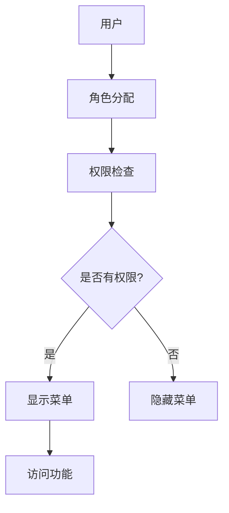
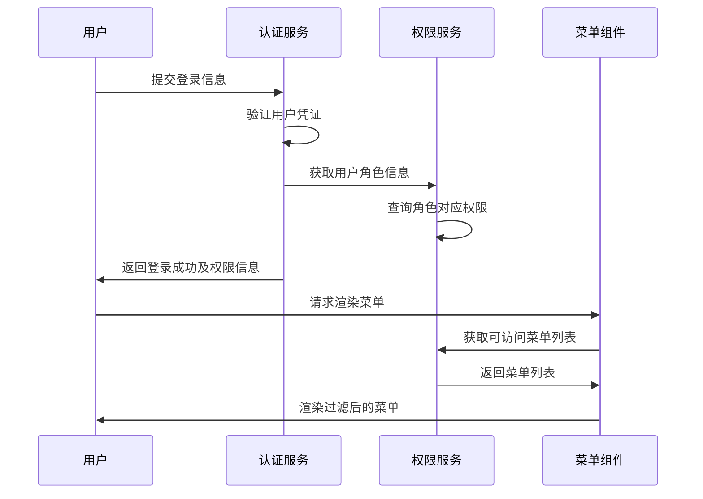
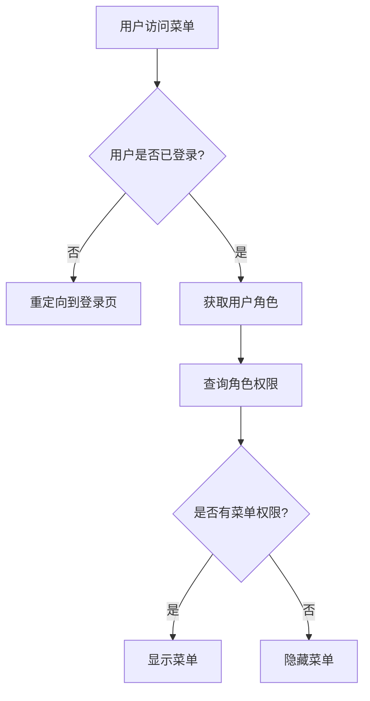

# 营销管理后台权限管理体系设计文档

## 1. 概述

### 1.1 项目背景
CDP（Customer Data Platform）是一个客户数据平台项目，旨在整合用户数据、提供AI驱动的营销策略和用户行为分析能力。营销管理后台是CDP系统的重要组成部分，为营销人员提供权限管理功能。

### 1.2 设计目标
本设计旨在为营销管理后台提供一个简洁高效的权限管理体系，通过控制菜单的显示/隐藏来实现不同角色用户的访问控制，提升系统的安全性和易用性。

### 1.3 设计原则
- 简洁性：仅控制菜单显示，不涉及复杂的字段级权限控制
- 易用性：提供直观的权限配置界面
- 可扩展性：支持未来功能扩展
- 安全性：确保权限控制的有效性

## 2. 系统架构

### 2.1 整体架构
营销管理后台权限管理体系采用基于角色的访问控制（RBAC）模型，通过角色与菜单权限的关联实现访问控制。



### 2.2 核心组件
1. **权限管理服务**：负责权限验证和菜单过滤
2. **角色管理模块**：管理用户角色和权限分配
3. **菜单控制组件**：根据权限控制菜单显示
4. **权限配置界面**：提供管理员配置权限的界面

### 2.3 技术栈
- React 18 + TypeScript
- Tailwind CSS
- Zustand 状态管理
- React Router v6

## 3. 权限模型设计

### 3.1 角色定义
| 角色名称 | 描述 | 权限范围 |
|---------|------|---------|
| 超级管理员 | 系统最高权限用户 | 所有菜单项 |
| 营销经理 | 负责营销策略制定和管理 | 营销策略、用户画像、效果追踪等核心功能 |
| 营销专员 | 执行具体的营销任务 | 用户画像查看、营销活动执行 |
| 数据分析师 | 负责数据分析和报表 | 效果追踪、数据分析相关功能 |

### 3.2 菜单权限项
| 菜单ID | 菜单名称 | 描述 | 默认角色 |
|-------|---------|------|---------|
| dashboard | 系统概览 | 营销后台首页仪表盘 | 全部角色 |
| user-profile | 用户画像 | 用户画像管理 | 营销经理、营销专员、数据分析师 |
| ai-strategy | AI营销策略 | AI驱动的营销策略制定 | 营销经理 |
| effect-tracking | 效果追踪 | 营销效果追踪分析 | 营销经理、数据分析师 |
| user-list | 用户列表 | 用户管理列表 | 营销经理、营销专员 |
| real-time-monitoring | 实时监控 | 实时监控中心 | 营销经理、数据分析师 |
| response-actions | 响应动作 | 响应动作管理 | 营销经理 |
| organization | 组织管理 | 组织架构管理 | 超级管理员 |
| security-permissions | 安全与权限 | 权限管理配置 | 超级管理员 |

## 4. 功能模块设计

### 4.1 权限验证模块
负责验证用户是否具有访问特定菜单项的权限。

#### 4.1.1 核心功能
- 用户角色获取
- 权限检查逻辑
- 菜单过滤处理

#### 4.1.2 接口设计
```typescript
// 权限服务接口
interface PermissionService {
  // 检查用户是否具有指定菜单权限
  hasMenuPermission(menuId: string): boolean;
  
  // 获取用户角色
  getUserRoles(): string[];
  
  // 获取用户可访问的菜单列表
  getAccessibleMenus(): string[];
}
```

### 4.2 菜单控制模块
根据用户权限控制菜单的显示与隐藏。

#### 4.2.1 核心功能
- 菜单项渲染控制
- 动态菜单过滤
- 路由访问控制

#### 4.2.2 组件设计
```tsx
// 菜单权限控制组件示例
interface MenuItem {
  id: string;
  label: string;
  path: string;
  icon: ReactNode;
}

const PermissionMenu = ({ menuItems }: { menuItems: MenuItem[] }) => {
  const accessibleMenus = permissionService.getAccessibleMenus();
  
  return (
    <nav>
      <ul>
        {menuItems
          .filter(item => accessibleMenus.includes(item.id))
          .map(item => (
            <li key={item.id}>
              <Link to={item.path}>
                {item.icon}
                <span>{item.label}</span>
              </Link>
            </li>
          ))}
      </ul>
    </nav>
  );
};
```

### 4.3 权限配置模块
提供管理员配置角色权限的界面。

#### 4.3.1 核心功能
- 角色管理
- 权限分配
- 配置保存

#### 4.3.2 界面设计
采用主从布局设计：
- 左侧：角色列表（25%宽度）
- 右侧：权限配置区域（75%宽度）

## 5. 数据模型设计

### 5.1 角色模型
```typescript
interface Role {
  id: string;           // 角色ID
  name: string;         // 角色名称
  description: string;  // 角色描述
  menuIds: string[];    // 可访问的菜单ID列表
  isSystem: boolean;    // 是否为系统角色
  createdAt: string;    // 创建时间
  updatedAt: string;    // 更新时间
}
```

### 5.2 用户角色关联模型
```typescript
interface UserRole {
  userId: string;   // 用户ID
  roleId: string;   // 角色ID
  assignedAt: string; // 分配时间
}
```

### 5.3 菜单模型
```typescript
interface MenuItem {
  id: string;       // 菜单ID
  label: string;    // 菜单名称
  path: string;     // 路由路径
  icon: string;     // 图标
  parentId?: string; // 父级菜单ID（用于嵌套菜单）
}
```

## 6. 权限控制流程

### 6.1 用户登录流程


### 6.2 权限检查流程


## 7. 界面设计

### 7.1 菜单显示控制
- 根据用户权限动态渲染菜单项
- 无权限的菜单项完全隐藏（不渲染）
- 支持菜单项的嵌套结构控制

### 7.2 权限配置界面
采用主从布局设计：
- 左侧角色列表区域（25%宽度）
- 右侧权限配置区域（75%宽度）
- 支持角色的增删改查操作
- 支持为角色分配菜单权限

## 8. 安全设计

### 8.1 权限验证
- 前端权限控制仅用于界面展示
- 后端API需进行独立的权限验证
- 防止通过直接URL访问未授权功能

### 8.2 数据保护
- 用户权限信息加密存储
- 敏感操作需二次确认
- 操作日志记录

## 9. 部署与维护

### 9.1 部署要求
- 与现有CDP系统集成
- 不影响现有功能模块
- 支持灰度发布

### 9.2 维护考虑
- 权限配置的备份与恢复
- 角色权限变更的日志记录
- 性能监控与优化