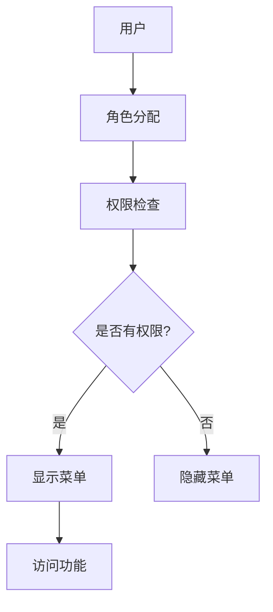

# 营销管理后台权限管理体系使用说明

## 概述

营销管理后台权限管理体系是CDP系统的一个重要组成部分，旨在为营销管理后台提供简洁高效的权限管理功能。该体系通过控制菜单的显示/隐藏来实现不同角色用户的访问控制，提升系统的安全性和易用性。

## 系统架构

营销管理后台权限管理体系采用基于角色的访问控制（RBAC）模型，通过角色与菜单权限的关联实现访问控制。

## 核心组件

1. **权限管理服务** (`marketingPermissionService.ts`) - 负责权限验证和菜单过滤
2. **菜单控制组件** (`MarketingMenu.tsx`) - 根据权限控制菜单显示
3. **权限配置页面** (`MarketingPermissionManagement.tsx`) - 提供管理员配置权限的界面
4. **营销管理后台布局** (`MarketingLayout.tsx`) - 营销管理后台的专用布局组件

## 角色定义

系统预定义了以下四种角色：

| 角色名称 | 描述 | 权限范围 |
|---------|------|---------|
| 超级管理员 | 系统最高权限用户 | 所有菜单项 |
| 营销经理 | 负责营销策略制定和管理 | 营销策略、用户画像、效果追踪等核心功能 |
| 营销专员 | 执行具体的营销任务 | 用户画像查看、营销活动执行 |
| 数据分析师 | 负责数据分析和报表 | 效果追踪、数据分析相关功能 |

## 菜单权限项

| 菜单ID | 菜单名称 | 描述 | 默认角色 |
|-------|---------|------|---------|
| dashboard | 系统概览 | 营销后台首页仪表盘 | 全部角色 |
| user-profile | 用户画像 | 用户画像管理 | 营销经理、营销专员、数据分析师 |
| ai-strategy | AI营销策略 | AI驱动的营销策略制定 | 营销经理 |
| effect-tracking | 效果追踪 | 营销效果追踪分析 | 营销经理、数据分析师 |
| user-list | 用户列表 | 用户管理列表 | 营销经理、营销专员 |
| real-time-monitoring | 实时监控 | 实时监控中心 | 营销经理、数据分析师 |
| response-actions | 响应动作 | 响应动作管理 | 营销经理 |
| organization | 组织管理 | 组织架构管理 | 超级管理员 |
| security-permissions | 安全与权限 | 权限管理配置 | 超级管理员 |

## 使用方法

### 1. 访问营销管理后台

1. 登录管理后台
2. 在左侧导航菜单中点击"营销管理"进入营销管理后台

### 2. 配置角色权限

1. 在营销管理后台，点击"安全与权限"菜单项
2. 在左侧角色列表中选择要配置的角色
3. 在右侧权限配置区域，勾选或取消勾选相应的菜单项
4. 点击"保存修改"按钮保存配置

### 3. 查看权限效果

1. 不同角色的用户登录后，只能看到自己有权限访问的菜单项
2. 无权限的菜单项将完全隐藏，无法通过URL直接访问

## 技术实现

### 权限服务

权限服务 (`marketingPermissionService.ts`) 提供了以下核心方法：

- `getCurrentUserRoles()`: 获取当前用户角色
- `hasMenuPermission(menuId)`: 检查用户是否具有指定菜单权限
- `getAccessibleMenus()`: 获取用户可访问的菜单列表
- `getAllMenus()`: 获取所有菜单项
- `getAllRoles()`: 获取所有角色
- `getRolePermissions(role)`: 获取角色对应的菜单权限

### 菜单控制

菜单控制组件 (`MarketingMenu.tsx`) 根据用户权限动态渲染菜单项：

1. 获取用户有权限访问的菜单列表
2. 过滤出用户可访问的菜单项
3. 动态渲染菜单项

### 权限配置

权限配置页面 (`MarketingPermissionManagement.tsx`) 提供了管理员配置角色权限的界面：

1. 主从布局设计：左侧角色列表（25%宽度），右侧权限配置区域（75%宽度）
2. 支持为不同角色配置不同的菜单权限
3. 实时保存权限配置

## 扩展与维护

### 添加新菜单项

1. 在 `marketingMenuItems` 数组中添加新的菜单项
2. 为新菜单项指定相应的角色权限
3. 在 `MarketingMenu.tsx` 中为新菜单项添加图标

### 添加新角色

1. 在 `MarketingRole` 类型中添加新的角色
2. 在 `rolePermissions` 对象中为新角色配置权限
3. 在 `mockRoles` 数组中添加新角色的信息

### 更新权限逻辑

1. 修改 `hasMenuPermission` 方法中的权限检查逻辑
2. 更新 `getRolePermissions` 方法中的权限获取逻辑

## 安全考虑

1. 前端权限控制仅用于界面展示，后端API需进行独立的权限验证
2. 防止通过直接URL访问未授权功能
3. 敏感操作需二次确认
4. 操作日志记录

## 部署与维护

1. 与现有CDP系统集成
2. 不影响现有功能模块
3. 支持灰度发布
4. 权限配置的备份与恢复
5. 角色权限变更的日志记录